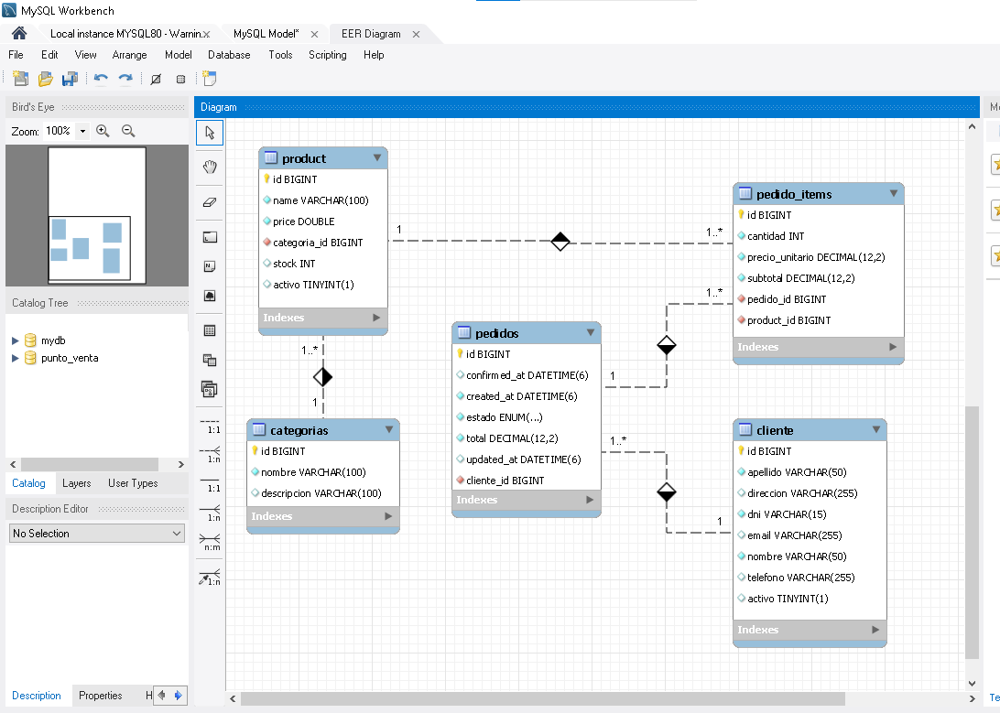

# API de Punto de Venta

Esta es una API RESTful para gestionar productos, clientes y pedidos en un sistema de punto de venta. Permite realizar operaciones CRUD sobre productos (con sus categorías), clientes y pedidos, con borrado lógico para productos y clientes.

## 🚀 Características

- **Gestión de Productos**:
  - Creación de nuevos productos con nombre, precio y categoría.
  - Consulta de todos los productos o de un producto específico por su ID.
  - Actualización parcial de productos (nombre, precio, categoría).
  - Eliminación lógica de productos mediante soft delete.
  - Control de stock con operaciones de Agregar, Restar y Ajustar.
- **Gestión de Categorías**:
  - Cada producto está asociado a una categoría existente.
  - Verificación automática de categorías: Si la base de datos de categorías está vacía al iniciar la aplicación, se crea una categoría `GENERAL` por defecto con ID `1`.
- **Gestión de Clientes**:
  - Creación de nuevos clientes con nombre, apellido y DNI único.
  - Consulta de todos los clientes, por ID o por DNI.
  - Actualización parcial de la información de los clientes (nombre, apellido, email, teléfono, dirección).
  - Eliminación lógica de clientes mediante soft delete.
- **Gestión de Pedidos**:
  - Creación de pedidos asociados a un cliente con varios productos.
  - Confirmación de pedidos con descuento de stock.
  - Cancelación de pedidos confirmados con restitución de stock.
  - Consulta de pedidos por ID, por cliente, por estado y por rango de fechas.
- **Validación de Datos**:
  - Validación robusta en los campos de los productos y clientes utilizando `jakarta.validation`.
- **Soft Delete**:
  - Los productos y clientes no se eliminan físicamente de la base de datos.
  - Las búsquedas y listados normales devuelven solo registros activos.
  - Los pedidos históricos se conservan aunque el cliente o producto se den de baja luego.
- **Soporte para CORS**:
  - Configuración habilitada para permitir peticiones desde diferentes orígenes, facilitando la integración con aplicaciones frontend modernas (React, Vue, Angular) que corran en puertos distintos.
- **Manejo Global de Excepciones**:
  - Respuestas de error estandarizadas para `ProductNotFoundException`, `CategoriaNotFoundException`, `ClienteNotFoundException`, `InsufficientStockException`, `IllegalArgumentException`, errores de validación (`MethodArgumentNotValidException`), JSON malformado (`HttpMessageNotReadableException`) y otros errores inesperados.
- **Tecnologías**:
  - Spring Boot
  - Spring Data JPA
  - H2 Database (o cualquier otra base de datos configurada)

## 🗃️ DER del proyecto

El siguiente diagrama resume las entidades principales y sus relaciones en la base de datos.



## 📋 Endpoints

A continuación, se detallan los endpoints disponibles en la API y cómo utilizarlos.
La URL base para todos los endpoints es `http://localhost:8080`.

### 1. Obtener todos los productos

- **Método:** `GET`
- **URL:** `/products`
- **Descripción:** Recupera una lista de todos los productos activos existentes en la base de datos.
- **Respuesta Exitosa (200 OK):**
  ```json
  [
    {
      "id": 1,
      "name": "Manzanas",
      "price": 1.5,
      "categoria": {
        "id": 1,
        "name": "Frutas",
        "description": "Frutas frescas"
      }
    },
    {
      "id": 2,
      "name": "Leche",
      "price": 2.2,
      "categoria": {
        "id": 2,
        "name": "Lácteos",
        "description": "Productos lácteos"
      }
    }
  ]
  ```

### 2. Obtener un producto por ID

- **Método:** `GET`
- **URL:** `/products/{id}`
- **Descripción:** Recupera los detalles de un producto específico utilizando su ID.
- **Respuesta Exitosa (200 OK):**
  ```json
  {
    "id": 1,
    "name": "Manzanas",
    "price": 1.5,
    "categoria": {
      "id": 1,
      "name": "Frutas",
      "description": "Frutas frescas"
    }
  }
  ```
- **Respuesta de Error (404 Not Found):**
  ```json
  {
    "message": "Producto con ID 999 no encontrado",
    "timestamp": "2023-10-27T10:00:00.123456",
    "status": 404
  }
  ```

### 3. Crear un nuevo producto

- **Método:** `POST`
- **URL:** `/products`
- **Descripción:** Crea un nuevo producto. Es obligatorio proporcionar el `name`, `price` y el `id` de una `categoria` existente.
- **Cuerpo de la Solicitud (Request Body):**
  ```json
  {
    "name": "Pan Integral",
    "price": 3.0,
    "categoria": {
      "id": 1
    }
  }
  ```
- **Respuesta Exitosa (201 Created):**
  ```json
  {
    "id": 3,
    "name": "Pan Integral",
    "price": 3.0,
    "categoria": {
      "id": 1,
      "name": "GENERAL",
      "description": "Categoría por defecto para productos"
    }
  }
  ```
- **Respuesta de Error (400 Bad Request):** (Ejemplos de errores de validación o categoría no encontrada)
  ```json
  {
    "message": "Error de validación en los campos",
    "timestamp": "2023-10-27T10:05:00.123456",
    "status": 400,
    "data": {
      "name": "El nombre debe tener entre 2 y 100 caracteres"
    }
  }
  ```
  O si la categoría no existe:
  ```json
  {
    "message": "Categoría con ID 999 no encontrada",
    "timestamp": "2023-10-27T10:05:00.123456",
    "status": 404
  }
  ```

### 4. Actualizar un producto existente

- **Método:** `PUT`
- **URL:** `/products/{id}`
- **Descripción:** Actualiza parcial o totalmente un producto existente. Solo los campos presentes en el cuerpo de la solicitud y que no sean nulos/vacíos serán actualizados. Para actualizar la categoría, se debe enviar el objeto `categoria` con su `id`.
- **Cuerpo de la Solicitud (Request Body - Ejemplo de actualización de categoría y precio):**
  ```json
  {
    "price": 3.5,
    "categoria": {
      "id": 2
    }
  }
  ```
- **Respuesta Exitosa (200 OK):**
  ```json
  {
    "id": 3,
    "name": "Pan Integral",
    "price": 3.5,
    "categoria": {
      "id": 2,
      "name": "Lácteos",
      "description": "Productos lácteos"
    }
  }
  ```
- **Respuesta de Error (404 Not Found / 400 Bad Request):** Similar a los errores en la creación o recuperación.

### 5. Eliminar un producto

- **Método:** `DELETE`
- **URL:** `/products/{id}`
- **Descripción:** Marca un producto como inactivo. El registro permanece en la base de datos.
- **Respuesta Exitosa (200 OK):**
  ```json
  {
    "message": "Producto con ID 3 eliminado exitosamente",
    "timestamp": "2023-10-27T10:15:00.123456",
    "status": 200
  }
  ```
- **Respuesta de Error (404 Not Found):**
  ```json
  {
    "message": "Producto con ID 999 no encontrado",
    "timestamp": "2023-10-27T10:15:00.123456",
    "status": 404
  }
  ```

### 6. Actualizar el stock de un producto

- **Método:** `PATCH`
- **URL:** `/products/{id}/stock`
- **Descripción:** Permite actualizar el stock de un producto utilizando diferentes operaciones (`AGREGAR`, `RESTAR`, `AJUSTAR`). Valida que el stock resultante no sea negativo y lanza una excepción si se intenta restar más cantidad de la disponible.
- **Cuerpo de la Solicitud (Request Body):**
  ```json
  {
    "cantidad": 15,
    "operacion": "AGREGAR"
  }
  ```
- **Respuesta Exitosa (200 OK):**
  ```json
  {
    "id": 1,
    "name": "Manzanas",
    "price": 1.5,
    "stock": 15,
    "categoria": {
      "id": 1,
      "name": "Frutas",
      "description": "Frutas frescas"
    }
  }
  ```
- **Respuesta de Error (400 Bad Request - Stock Insuficiente):**
  ```json
  {
    "message": "Stock insuficiente para realizar la operación. Stock actual: 10",
    "timestamp": "2023-10-27T10:20:00.123456",
    "status": 400
  }
  ```

---

### Endpoints de Clientes

Los endpoints para gestionar clientes están bajo el path `/clientes`.

#### 7. Obtener todos los clientes

- **Método:** `GET`
- **URL:** `/clientes`
- **Descripción:** Recupera la lista completa de todos los clientes activos.
- **Respuesta Exitosa (200 OK):**
  ```json
  [
    {
      "id": 1,
      "nombre": "Juan",
      "apellido": "Perez",
      "dni": "12345678",
      "email": "juan@example.com",
      "telefono": "11223344",
      "direccion": "Calle Falsa 123"
    }
  ]
  ```

#### 8. Obtener un cliente por ID

- **Método:** `GET`
- **URL:** `/clientes/{id}`
- **Descripción:** Recupera los detalles de un cliente específico utilizando su ID.
- **Respuesta Exitosa (200 OK):**
  ```json
  {
    "id": 1,
    "nombre": "Juan",
    "apellido": "Perez",
    "dni": "12345678",
    "email": "juan@example.com",
    "telefono": "11223344",
    "direccion": "Calle Falsa 123"
  }
  ```
- **Respuesta de Error (404 Not Found):**
  ```json
  {
    "message": "Cliente con ID 99 no encontrado",
    "timestamp": "2026-06-22T19:00:00.000",
    "status": 404
  }
  ```

#### 9. Obtener un cliente por DNI

- **Método:** `GET`
- **URL:** `/clientes/dni/{dni}`
- **Descripción:** Recupera un cliente específico por su DNI.
- **Respuesta Exitosa (200 OK):** (Igual al formato por ID)

#### 10. Crear un nuevo cliente

- **Método:** `POST`
- **URL:** `/clientes`
- **Descripción:** Crea un nuevo cliente. Los campos `nombre`, `apellido` y `dni` son obligatorios. El `dni` debe ser único en el sistema.
- **Cuerpo de la Solicitud (Request Body):**
  ```json
  {
    "nombre": "María",
    "apellido": "Gómez",
    "dni": "87654321",
    "email": "maria@example.com"
  }
  ```
- **Respuesta Exitosa (201 Created):**
  ```json
  {
    "id": 2,
    "nombre": "María",
    "apellido": "Gómez",
    "dni": "87654321",
    "email": "maria@example.com",
    "telefono": null,
    "direccion": null
  }
  ```
- **Respuesta de Error (400 Bad Request - DNI duplicado o validación fallida):**
  ```json
  {
    "message": "Ya existe un cliente registrado con el DNI 87654321",
    "timestamp": "2026-06-22T19:00:00.000",
    "status": 400
  }
  ```

#### 11. Actualizar un cliente existente

- **Método:** `PUT`
- **URL:** `/clientes/{id}`
- **Descripción:** Actualiza de forma parcial o total un cliente existente. Solo se actualizan los campos provistos no nulos y no vacíos.
- **Cuerpo de la Solicitud (Request Body):**
  ```json
  {
    "nombre": "María Clara",
    "direccion": "Avenida Siempre Viva 742"
  }
  ```
- **Respuesta Exitosa (200 OK):**
  ```json
  {
    "id": 2,
    "nombre": "María Clara",
    "apellido": "Gómez",
    "dni": "87654321",
    "email": "maria@example.com",
    "telefono": null,
    "direccion": "Avenida Siempre Viva 742"
  }
  ```

#### 12. Eliminar un cliente

- **Método:** `DELETE`
- **URL:** `/clientes/{id}`
- **Descripción:** Marca un cliente como inactivo. El registro permanece en la base de datos.
- **Respuesta Exitosa (200 OK):**
  ```json
  {
    "message": "Cliente con ID 2 eliminado exitosamente",
    "timestamp": "2026-06-22T19:00:00.000",
    "status": 200
  }
  ```

### Endpoints de Pedidos

Los pedidos se crean asociados a un cliente y pueden incluir varios productos. El flujo recomendado es crear primero un pedido en estado `BORRADOR`, confirmarlo cuando se quiera descontar stock y cancelarlo si hace falta revertir la operación.

Para probar este flujo desde el navegador, también existe una página de simulación en `src/main/resources/static/pedidos.html`.

#### 13. Crear un pedido

- **Método:** `POST`
- **URL:** `/pedidos`
- **Descripción:** Crea un pedido borrador para un cliente activo.
- **Cuerpo de la Solicitud (Request Body):**
  ```json
  {
    "clienteId": 1,
    "items": [
      { "productId": 2, "cantidad": 3 },
      { "productId": 4, "cantidad": 1 }
    ]
  }
  ```
- **Respuesta Exitosa (201 Created):**
  ```json
  {
    "id": 15,
    "clienteId": 1,
    "clienteNombre": "Juan Perez",
    "estado": "BORRADOR",
    "createdAt": "2026-06-23T10:15:00",
    "updatedAt": null,
    "confirmedAt": null,
    "total": 4500.0,
    "items": [
      {
        "id": 1,
        "productId": 2,
        "productName": "Mouse",
        "cantidad": 3,
        "precioUnitario": 1000.0,
        "subtotal": 3000.0
      }
    ]
  }
  ```

#### 14. Confirmar un pedido

- **Método:** `POST`
- **URL:** `/pedidos/{id}/confirmar`
- **Descripción:** Cambia el pedido a `CONFIRMADO` y descuenta el stock de los productos incluidos.

#### 15. Cancelar un pedido

- **Método:** `POST`
- **URL:** `/pedidos/{id}/cancelar`
- **Descripción:** Cambia el pedido a `CANCELADO`. Si el pedido estaba confirmado, devuelve el stock asociado.

#### 16. Obtener todos los pedidos

- **Método:** `GET`
- **URL:** `/pedidos`
- **Descripción:** Devuelve todos los pedidos cargados.

#### 17. Obtener un pedido por ID

- **Método:** `GET`
- **URL:** `/pedidos/{id}`
- **Descripción:** Recupera el detalle completo de un pedido.

#### 18. Obtener pedidos por cliente

- **Método:** `GET`
- **URL:** `/pedidos/cliente/{clienteId}`
- **Descripción:** Devuelve todos los pedidos asociados a un cliente específico.

#### 19. Obtener pedidos por estado

- **Método:** `GET`
- **URL:** `/pedidos/estado/{estado}`
- **Descripción:** Filtra pedidos por estado. Valores válidos: `BORRADOR`, `CONFIRMADO`, `CANCELADO`.

#### 20. Obtener pedidos por rango de fechas

- **Método:** `GET`
- **URL:** `/pedidos/rango?desde=2026-06-01T00:00:00&hasta=2026-06-30T23:59:59`
- **Descripción:** Devuelve los pedidos creados dentro del rango indicado.

## 🛠️ Cómo Iniciar la Aplicación

1.  **Clonar el repositorio:** (Si aplica)
2.  **Configuración de la Base de Datos:** Asegúrate de que `application.properties` esté configurado correctamente para la base de datos MySql.
3.  **Compilar y Ejecutar:**
   ```bash
   ./mvnw spring-boot:run
   ```
4.  La API estará disponible en `http://localhost:8080`. Se puede probar levantando `index.html` o `pedidos.html` desde `src/main/resources/static` en el navegador.
